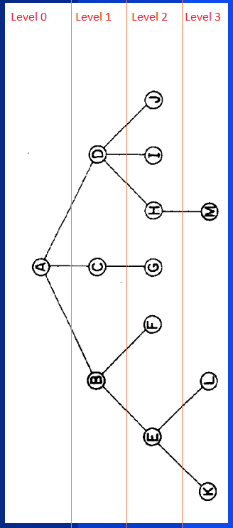

# CSV to JSON Converter

This is an implementation works with a structure in CSV file, which represents a nested JSON, with parents and children. The algorithm presented here converts this format from CSV to specific JSON.
A JSON data structure can be very useful for representing nested data types, as in the case of the project: https://github.com/lucaspedro/JSON-Parameterizable-Side-Bar.
However, a CSV data structure is much more easily filled out by a lay user, making the interest in such an implementation greater.

# Configuration

The implementation includes packages bellow:
* csv


To install the necessary packages just follow the steps below:

```
# Install csv package
$ pip install csv
```

# Recursive Implementation

This was a simple implementation, involving recursive code capable of generating a string that represents the nested JSON. This string needs a recursive nature to fit your children and parents in the right places, however the CSV structure is completely iterative, so the code works with an iterative search on a recursive structure construction.


The main function that performs the recursive mapping is shown below:
```
# input variables:
#  data is a string vector that represents the CSV content
#  curr_lvl is an intenger that indicates the current level of recursive construction
#  father is string that represents the parent identifier of that node
#  curr_num_brothers is an intenger that represent the number of brothers this node has

def json_generator_by_csv(data, curr_lvl, father, curr_num_brothers):
    ret=""
    count_brother = 0
    for row in data:
        if str(curr_lvl)==str(row[0]) and str(father)==str(row[4]):
            count_brother+=1
            ret += '{'
            ret += '"title": "'+row[1]+'",'
            ret += '"icon": "'+row[2]+'"'
            if str(row[3]) != str(None):
                num_brothers = str(row[3]).count(",")
                ret += ', "child":['
                ret += json_generator_by_csv(data, curr_lvl+1, row[1], num_brothers)
                ret += ']'
            ret += "}"
            if int(count_brother)<=int(curr_num_brothers):
                ret+=","
    return str(ret)
```


# How to Use

To change the CSV file just change its location/name as shown in the following excerpt:

```
####################################################################

# Here you can change the CSV file:

file_csv = 'static/data/side_menu_.csv'

####################################################################
```

The CSV file must follow the following pattern defined to work correctly:

```
level,title,icon,children,father
0,A1,list,"C1,C2,C3",None
0,A2,list,B2,None
0,A3,list,"B1,B3",None
1,C1,pie_chart,None,A1
1,C2,pie_chart,None,A1
1,B2,pie_chart,None,A2
1,C3,list,"D1,D2,D3",A1
0,A5,list,None,None
2,D1,view_quilt,None,C3
1,B3,pie_chart,None,A3
2,D2,pie_chart,None,C3
2,D3,view_quilt,E1,C3
1,B1,pie_chart,None,A3
4,F1,view_quilt,None,E1
0,A4,list,None,None
3,E1,view_quilt,F1,D3
```
When a node has no children or parent, None should be used to indicate the void.

# Structure

The chosen CSV structure works with levels, parents and children to make the correct linking of nodes. The tree shown below exemplifies the linking of nodes in a JSON file. The level variable indicates the position of each group of nodes that have the same height, this is a common concept of tree structure in programming. It can also be seen in the figure, that the node "D" is a child of "A" and that the node "D" has children "H", "I" and "J". Through this information it is possible to map a nested JSON to CSV and vice versa.


